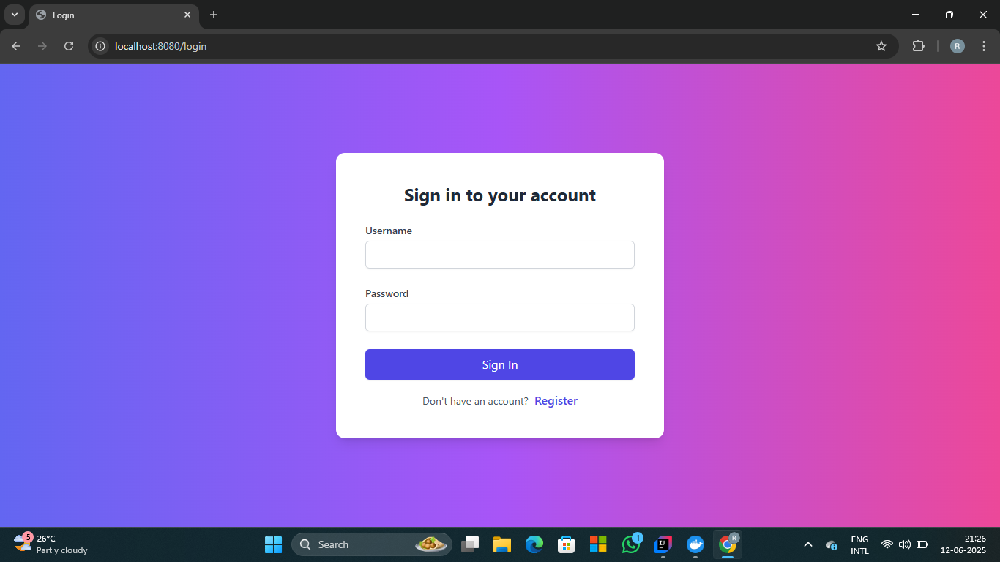

# 📘 Content Saving Web App

A simple and secure web application built using **Spring Boot**, **Spring Security**, **Thymeleaf**, and **JPA** that allows users to create, view, and manage content entries (like notes, blog posts, or articles).

---

## 🛠️ Tech Stack

- **Spring Boot**
- **Spring Security**
- **Spring Data JPA**
- **Thymeleaf**
- **PostgreSQL** 
- **Bootstrap 5**

---

## 🔐 Features

- ✅ User Registration
- ✅ Password Encoding using BCrypt
- ✅ User authentication (Spring Security)
- 📝 Create, list, and view content
- 🎨 Responsive and user-friendly UI (Bootstrap + Thymeleaf)
- 🧵 Clean MVC structure
- 🔐 Protected endpoints

---

## ⚙️ Configuration

### application.properties

```properties
# Server
server.port=8080

# H2 (for dev)
spring.datasource.url=jdbc:h2:mem:contentdb
spring.datasource.driverClassName=org.h2.Driver
spring.datasource.username=sa
spring.datasource.password=
spring.h2.console.enabled=true

# JPA
spring.jpa.hibernate.ddl-auto=update
spring.jpa.show-sql=true

# Thymeleaf
spring.thymeleaf.cache=false

```
---
## Getting Started
### Prerequisites

Ensure you have the following installed:

- Java (JDK 17 or above)
- Maven
- Git (for cloning)
- IDE (like IntelliJ IDEA or VS Code)

---

### How to Run

#### 1. Clone the repository

```bash
git clone https://github.com/Rahulkumar-06/Thymeleaf-Demo.git
cd your-repo-name
```
### 2. Update application properties
 * Configure your application.properties or application.yml as needed, for example: 
### Example for H2 database
```properties
spring.datasource.url=jdbc:h2:mem:testdb
spring.datasource.driverClassName=org.h2.Driver
spring.datasource.username=sa
spring.datasource.password=
spring.jpa.database-platform=org.hibernate.dialect.H2Dialect

spring.h2.console.enabled=true
```
### 3. Run the project using Maven
```bash
    mvn spring-boot:run
```
---
## Accessing the Application
- Home Page : http://localhost:8080
- Registration Page : http://localhost:8080/registere (unauthorized)
- ListContent : http://localhost:8080/content/list

---
## Registration Page :


---
## Home Page :


---
## Login Page :


---

## List Page :


---

## Cloud Deployed Project

#### Link :  [ProjectLink](13.221.201.127:8080)
